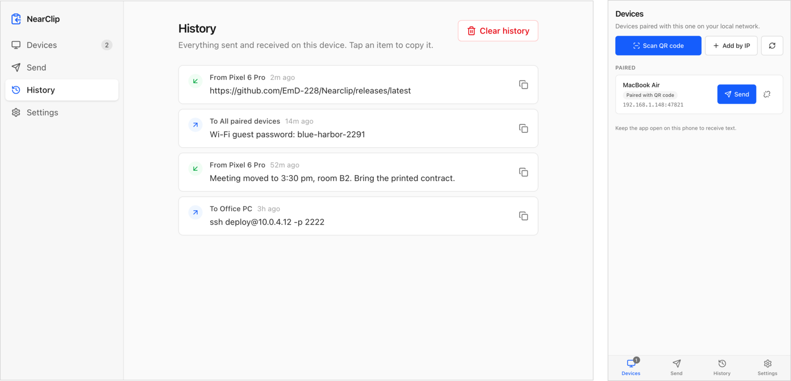

# NearClip

Copy on one device, paste on the other. NearClip sends clipboard text between your computer and your phone over the local network, end-to-end encrypted, with no server, no account and nothing leaving your Wi-Fi.

<picture>
  <source media="(prefers-color-scheme: dark)" srcset="docs/screenshots/nearclip-dark.webp">
  
</picture>

Built with Tauri v2, Rust and Svelte 5; runs on macOS, Windows, Linux and Android.

## Download

Installers for every version are on the [Releases page](https://github.com/EmD-228/Nearclip/releases):

| Platform | File |
| --- | --- |
| macOS (Apple Silicon) | `.dmg` |
| Windows | `-setup.exe` |
| Linux | `.AppImage` (make it executable with `chmod +x` first) |
| Android | `.apk` |

They are built by GitHub Actions from the tagged commit and are not notarized or trust-signed: on macOS, right-click the app and choose Open the first time; on Windows, dismiss SmartScreen with "More info" then "Run anyway".

## Features

- Send text manually to one paired device or to all of them, with a Paste button to grab the current clipboard.
- Send files and photos up to 100 MB: attach or drop them in the Send view. Received files go to Downloads/NearClip, and History opens their folder on desktop or shares them on Android. Devices still on 0.1.x receive text only, and the sender is told so.
- Optional auto-sync: on desktop every text you copy is sent to your paired devices; on Android, where the clipboard cannot be read in the background, the last copied text is sent each time NearClip opens (the persistent notification has a "Send clipboard" button for that).
- History of sent and received items, with one-click copy.
- Write received text straight to the local clipboard (toggle).
- Pair a phone by scanning a QR code shown on the computer (one scan, no code to compare), or add a device by IP address and compare a 6-digit code. Automatic mDNS discovery is an opt-in, experimental setting, since many Wi-Fi networks block it. Paired devices show how they were paired rather than an online/offline state.
- Unpairing on one device tells the other to forget the pairing too; if that message cannot be delivered, the stale side drops the pairing the next time it tries to send.
- Android: "Share to NearClip" from any app's share sheet; the text or file lands in the Send view.
- Desktop: tray icon with close-to-tray behaviour, start at login (autostart).
- System notifications when text or a file is received.

Text messages are limited to 1 MB. On Android a persistent "Listening for text" notification keeps the app receiving in the background; its Stop button pauses that until the app is next opened.

## Requirements

- Rust stable, installed with [rustup](https://rustup.rs)
- Node 22
- pnpm 10
- macOS: Xcode Command Line Tools (`xcode-select --install`)
- Windows: Visual Studio C++ Build Tools and the WebView2 runtime (preinstalled on Windows 10/11)
- Linux (Debian/Ubuntu): the system libraries installed by `sh scripts/install-linux-deps.sh`
- Android: Android Studio with an SDK (platform 36) and an NDK, plus the Rust targets:

```sh
rustup target add aarch64-linux-android armv7-linux-androideabi i686-linux-android x86_64-linux-android
export JAVA_HOME="/Applications/Android Studio.app/Contents/jbr/Contents/Home"   # bundled JDK 21
export ANDROID_HOME="$HOME/Library/Android/sdk"
export NDK_HOME="$ANDROID_HOME/ndk/<version>"
```

## Development

```sh
pnpm install
pnpm tauri dev
```

`pnpm tauri dev` starts Vite on port 1420 and launches the Tauri window with hot reload for both the Svelte frontend and the Rust backend.

### Running two instances on one machine

Pairing and sending need two devices. To test without a second computer, run a second instance in another terminal:

```sh
# terminal 1
pnpm tauri dev

# terminal 2
pnpm dev:2
```

`pnpm dev:2` uses `src-tauri/tauri.dev2.conf.json`, which overrides the first instance so both can coexist:

- a second bundle identifier, `com.nearclip.dev2`, so it gets its own app data directory (identity, pairings, settings, history);
- a separate Vite port, 1422;
- a separate Cargo target directory, `src-tauri/target-2`, so the two builds do not lock each other;
- the TCP listener finds port 47821 already taken and falls back to an ephemeral port.

Pair the two windows with Add by IP, using the address and port shown under This device in the second instance's Settings.

### Android

The generated Android project in `src-tauri/gen/android` is committed because it carries hand-made additions that `pnpm tauri android init` would wipe: `NearclipService.kt` (foreground service that keeps the listener alive in the background and holds the multicast lock, without which Android drops mDNS packets), the system-bar and keyboard insets plus the notification permission request in `MainActivity.kt`, and in `AndroidManifest.xml` the network and foreground-service permissions, the `<service>` entry and the share-sheet intent filter. `build.gradle.kts` also has the release signing block and `minSdk = 26`. If you ever regenerate the project, reapply those from git history.

```sh
# debug APK for an arm64 phone (large: unstripped, debuggable)
pnpm tauri android build --debug --target aarch64 --apk --split-per-abi
# -> src-tauri/gen/android/app/build/outputs/apk/arm64/debug/app-arm64-debug.apk
```

Install it with `adb install -r <apk>`, or serve it on the LAN (`python3 -m http.server` in the APK folder) and download it from the phone's browser. `pnpm tauri android dev` also works with a phone connected over adb.

## Tests and checks

The same four commands gate every pull request in CI (`.github/workflows/build.yml`, job `check`):

```sh
pnpm check
cargo fmt --manifest-path src-tauri/Cargo.toml -- --check
cargo clippy --manifest-path src-tauri/Cargo.toml --all-targets -- -D warnings
cargo test --manifest-path src-tauri/Cargo.toml
```

## Building installers

```sh
pnpm tauri build
```

Each platform builds its own installers. GitHub Actions builds the published ones; the triggers, release rule and Android signing secrets are documented at the top of `.github/workflows/build.yml`. For your own Mac, `pnpm tauri build --bundles app` skips the dmg packaging and leaves `NearClip.app` in `src-tauri/target/release/bundle/macos/`, ready to copy to `/Applications`.

### macOS signing

`signingIdentity` is `-`, so the bundle is sealed with an ad hoc signature: no Apple account needed, but the identity changes with every build and macOS re-asks the permissions listed under Troubleshooting after each rebuild. For a stable identity, set the environment variable (in your shell profile, for instance) to a certificate from your keychain (`security find-identity -v -p codesigning`); a free Apple Development certificate or a self-signed code-signing certificate made in Keychain Access both work for your own machines:

```sh
APPLE_SIGNING_IDENTITY="Apple Development: Your Name (TEAMID)" pnpm tauri build
```

### Android release APK

Release builds are signed with a keystore that is not in git. Create it once:

```sh
cd src-tauri/gen/android
keytool -genkeypair -v -keystore nearclip-release.jks -alias nearclip \
  -keyalg RSA -keysize 2048 -validity 10000
cat > keystore.properties <<EOF
storeFile=nearclip-release.jks
storePassword=<password>
EOF
```

Back up the `.jks` and its password: every future update must be signed with the same key or Android refuses to install it over the previous version. Then:

```sh
pnpm tauri android build --target aarch64 --apk --split-per-abi
# -> src-tauri/gen/android/app/build/outputs/apk/arm64/release/app-arm64-release.apk
```

## Contributing

See [CONTRIBUTING.md](CONTRIBUTING.md); security reports go through [SECURITY.md](SECURITY.md).

## Security model

- Each device has a long-lived Ed25519 identity key. The fingerprint shown in Settings is derived from its public key.
- Pairing runs an X25519 ECDH exchange with a commitment step, so neither side can pick its ephemeral key after seeing the other's.
- The shared secret is expanded with HKDF bound to the full pairing transcript (both identity keys, both ephemeral keys, both nonces), and each side signs that transcript with its Ed25519 identity key so the pairing is tied to the identity that gets stored.
- When pairing by IP address, a 6-digit short authentication string (SAS) is derived from that transcript and displayed on both screens; pairing completes only when both users confirm the codes match, which defeats an active man-in-the-middle on the local network.
- QR pairing uses a visual channel instead of the code comparison: the QR carries the computer's public key and a one-time token valid for 5 minutes. The phone checks the key it connects to against the QR, the computer checks the token, and both sides then confirm on their own.
- Every connection after pairing derives a fresh per-connection session key from the paired secret. Payloads are encrypted with AES-256-GCM, including each chunk of a file, and a received file is kept only if its SHA-256 matches the one the sender announced.
- NearClip hides the text, not the traffic: anyone on the network can see that two devices talk, and when.
- The identity seed and the pairing keys are sealed with AES-256-GCM inside the JSON files under the app data directory (macOS: `~/Library/Application Support/com.nearclip/`). The 32-byte master key lives in the OS credential store on desktop (macOS Keychain, Windows Credential Manager, Secret Service on Linux) and in an app-private file on Android.

## Troubleshooting

- **macOS asks for Local Network access.** Allow it. If you refused, enable it under System Settings > Privacy & Security > Local Network.
- **macOS firewall prompt.** When the firewall is on, macOS asks whether NearClip may accept incoming connections. Choose Allow, or the other device cannot reach you.
- **Windows Firewall.** Allow NearClip on Private networks when prompted. If the network is marked Public, either switch it to Private or add a manual rule.
- **Devices cannot connect.** Guest, hotel and many office Wi-Fi networks isolate clients. Both devices must be on the same normal Wi-Fi or wired network. On networks that reassign addresses often, pair again with the QR code if a device stays unreachable.
- **Linux: no tray icon.** Stock GNOME has no tray area without the AppIndicator extension. Install it, or turn off "Keep running in the tray" so closing the window quits; launching NearClip again always brings the window back.
- **Linux: auto-sync under Wayland.** Background clipboard reads depend on the compositor, so auto-sync may miss copies made in other apps. Sending from the Send view always works.

## Project layout

```
src/                          Svelte 5 frontend
  App.svelte                  shell: sidebar, current view, dialogs, event listeners
  app.css                     Tailwind v4 entry and base styles
  lib/api.ts                  one function per Tauri command and per Rust event
  lib/types.ts                TypeScript mirrors of the Rust payload types
  lib/stores/                 rune-based stores (devices, history, settings, pairing, toasts, confirm)
  lib/components/             Sidebar, DeviceCard, Modal and the dialogs built on it, Toast, Toggle
  lib/views/                  Devices, Send, History, Settings

src-tauri/src/                Rust backend
  lib.rs                      app setup, plugin registration, background tasks
  error.rs                    AppError type shared by all modules and commands
  commands.rs                 Tauri commands exposed to the frontend
  state.rs                    shared app state, settings and persisted data
  identity.rs                 Ed25519 device identity and fingerprint
  crypto.rs                   X25519, HKDF, SAS, AES-256-GCM primitives
  protocol.rs                 wire messages and framing
  discovery.rs                mDNS advertisement and browsing
  transport.rs                TCP listener and outgoing connections
  pairing.rs                  pairing state machine (commitment, SAS, confirmation)
  session.rs                  per-connection encrypted sessions
  clipboard.rs                clipboard read/write and auto-sync watcher
  tray.rs                     tray icon and menu

design/icons/                 app icon sources (SVG) and the tauri icon manifest
docs/screenshots/             README screenshots
scripts/                      Linux build dependencies; screenshot capture with a mocked backend
```

The README screenshots are rendered from the built frontend with demo data (`scripts/screenshots/mock-tauri.js`); regenerate them after a visible UI change with `sh scripts/screenshots/capture.sh`.

## App icon

A clipboard with a proximity signal on a blue gradient. The SVG sources are in `design/icons/` (each file says what it is for; `icon-manifest.json` maps them to platforms). To regenerate every platform icon and commit the result:

```bash
pnpm tauri icon design/icons/icon-manifest.json
```

Not in the manifest: `src-tauri/icons/tray.png` (macOS menu bar), regenerated with `pnpm tauri icon design/icons/nearclip-tray.svg -o /tmp/tray -p 72`, and the hand-written `res/drawable/ic_notification.xml` (Android status bar, referenced by name from the foreground service and from the notifications built in `session.rs`; the notification plugin does not accept a config block).
